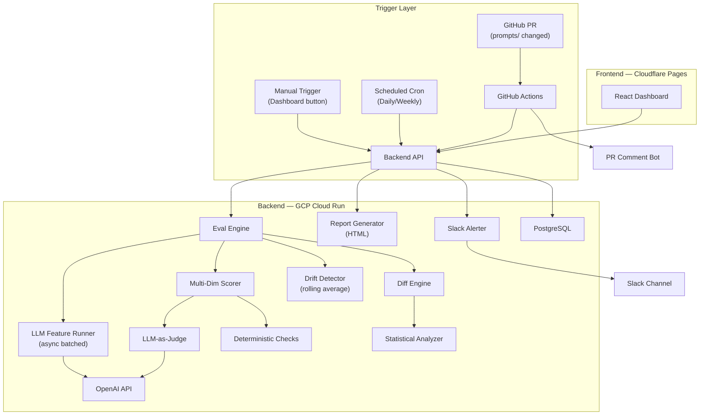

# Model Regression Detection System

A CI/CD-style pipeline that continuously tests any LLM-powered feature against a golden dataset whenever a prompt or model changes, detects quality regressions, and alerts your team via Slack before bad outputs reach users.

## Architecture

## Prerequisites
- Docker & docker-compose
- Python 3.11+
- Node 20+
- PostgreSQL 16 (handled by docker)

## Setup Instructions
1. Clone the repository
2. `cp .env.example .env` and fill in your keys
3. `make setup`
4. `make dev`

## Usage
- **Add Golden Dataset:** Add a JSON file to `golden-dataset/` 
- **Add Prompt:** Add a YAML file to `prompts/`
- **Adjust Thresholds:** Change `REGRESSION_WARNING_THRESHOLD` in `.env`
