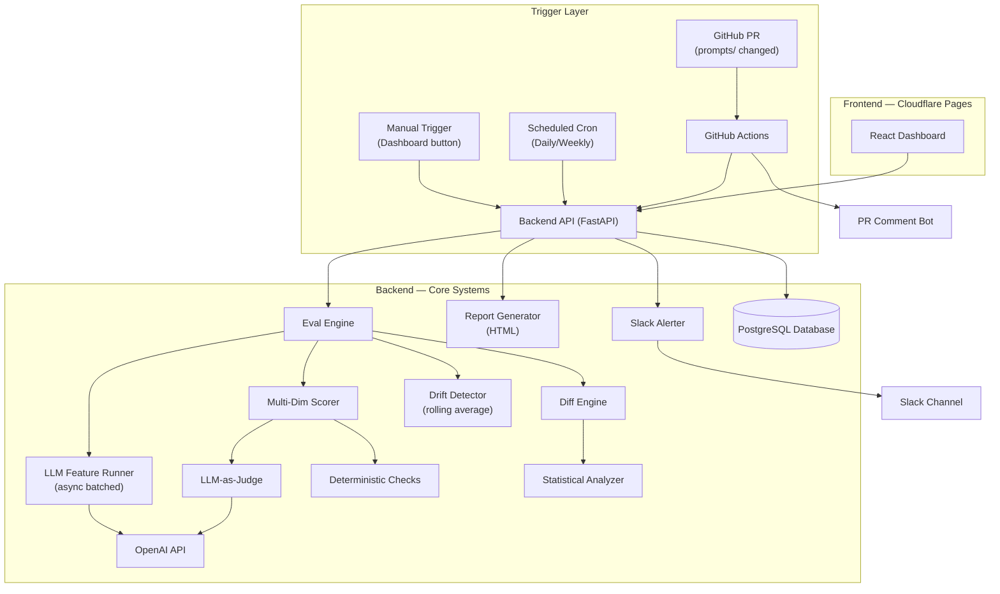

# Model Regression Detection System (MRDS) - Backend

**A Production-Grade AI Automation & Governance Platform**

MRDS is a CI/CD-style automation pipeline designed to bridge the gap between AI experimentation and enterprise deployment. It continuously tests any LLM-powered feature against a golden dataset whenever a prompt or model changes, detecting quality regressions and deploying automated business workflows (Slack alerts, Notion tickets) before bad outputs reach users.

**Business Impact:**
- **Automated QA:** Reduces manual testing time by over 80% through automated regression detection.
- **Cost Optimization:** Features an intelligent routing layer (LLM Cost Autopilot) to slash API costs by routing requests to cheaper models when complexity allows.
- **Enterprise Governance:** Built-in multi-tenancy, Role-Based Access Control (RBAC), and Human-In-The-Loop (HITL) approval workflows ensure that AI acts within strict compliance guidelines.

*Note: This system is built using an Agentic State Machine architecture. Please review [AGENTS.md](./AGENTS.md) for details on our multi-agent orchestration.*

## Tech Stack
- **Framework:** FastAPI (Python 3.11+)
- **Database ORM:** SQLAlchemy 2.0 (Async)
- **Migrations:** Alembic
- **Database:** PostgreSQL 16
- **Auth Provider:** Google OAuth2 + Resend (Email OTP Fallback)
- **Security:** PyJWT, Passlib

## Architecture


## Key Features

### 1. Robust Authentication & Multi-Tenancy
- Supports **Google OAuth** login flow.
- Fallback **Email OTP** powered by Resend (Generates, hashes, and validates 6-digit codes).
- Total data isolation via Organization Multi-Tenancy (`get_current_org` FastAPI dependency).

### 2. Role-Based Access Control (RBAC)
- Built-in Super Admin architecture (`is_superadmin`).
- Secure `/api/v1/admin` endpoints guarded by `get_super_admin` middleware.

### 3. Server-Side Pagination
All endpoints natively support robust filtering and pagination:
- **Eval Runs:** Handled via native SQL `OFFSET`/`LIMIT` clauses.
- **Analytics:** Trend data is natively grouped by `func.date()` and aggregated via SQL `func.avg()`.
- **Prompts & Datasets:** Dynamically paginated and filtered in-memory via the File Loaders.

## Setup Instructions

1. **Prerequisites:**
   - Docker & docker-compose
   - Python 3.11+
   - PostgreSQL 16 (handled by docker)

2. **Environment Setup:**
   ```bash
   # Clone the repository
   cp .env.example .env
   ```
   *Make sure to configure your `DATABASE_URL` and `RESEND_API_KEY` in the `.env`.*

3. **Install Dependencies:**
   ```bash
   python -m venv venv
   source venv/bin/activate
   pip install -r requirements.txt
   ```

4. **Run Migrations (Alembic):**
   ```bash
   alembic upgrade head
   ```

5. **Start Server:**
   ```bash
   uvicorn app.main:app --reload
   ```

## Usage
- **Add Golden Dataset:** Add a JSON file to `golden-dataset/` 
- **Add Prompt:** Add a YAML file to `prompts/`
- **Adjust Thresholds:** Change `REGRESSION_WARNING_THRESHOLD` in `.env`
